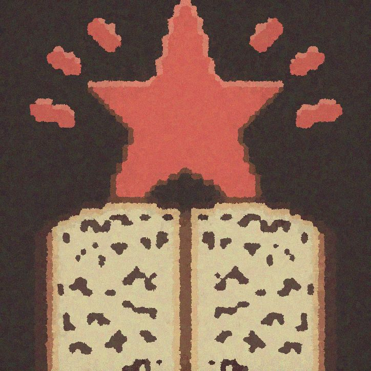

<h1 align="center">
 	
	 
	The People's Land of Learning Website
</h1>

An educational resource for Anti-Colonial Marxist Leninist theory.

 

This website dedicated to the gathering of resources pertaining to scientific socialism and anti-imperialist thought. It is our hope that people new to socialism will be able to educate themselves and others with these resources. Remember: Communism will win!

Feedback and suggestions are always welcome! This site is very much a work in progress, so any improvements to the design or code that are offered is well appreciated.
